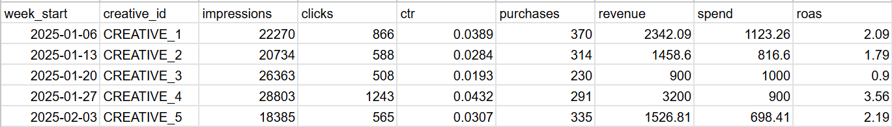

# 🎨 Creative Performance Analyzer

This is a simple Streamlit web app that allows marketers and analysts to analyze the performance of creative assets  using performance data and Gemini AI.

## 📂 Features

- Upload a CSV file with creative performance metrics

- Upload the matching creative image files
- Uses Google Gemini to analyze which creatives perform best and why
- Displays results in a clean and interactive interface

## 🛠 Setup Instructions

1. Clone the repository:

```bash
git clone https://github.com/yourusername/creative_app.git
cd creative_app
```

then you can run the app in the directovery
```bash
streamlit run app.py
```
